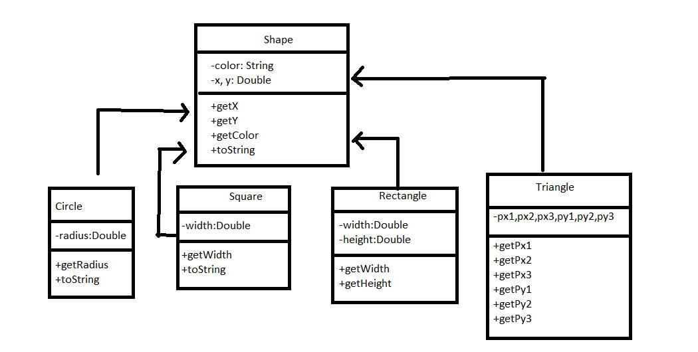

# cn332hw1
Class Shape เป็น class ที่เป็น super class ของ class ลูกๆ ที่ extend ไปก็คือ class Circle, Square, Rectangle และ Triangle ตามลำดับ
ซึ่งการออกแบบในลักษณะนี้จะรองรับการเปลี่ยนแปลงในลักษณะที่ว่า 
1.หากเราต้องการสร้าง object ประเภทใหม่ ก็สามารถ extend มาจาก shape ได้เลย อย่างเช่นว่าเราจะสร้าง object ใหม่ ที่เป็น ห้าเหลี่ยม ก็สามารถ extend มาได้เลย แต่ว่าต้องแก้ในส่วนของการอ่านข้อมูลเนื่องจากว่า รูปห้าเหลี่ยมนี้จำเป็นต้องใช้ parameter ในการสร้าง object ใหม่
2.หากเราต้องการเปลี่ยน สีที่สามารถแสดงได้ ก็สามารถเพิ่มตัวแปร field จากเดิมที่เป็น color เป็นแบบ R G B ได้

